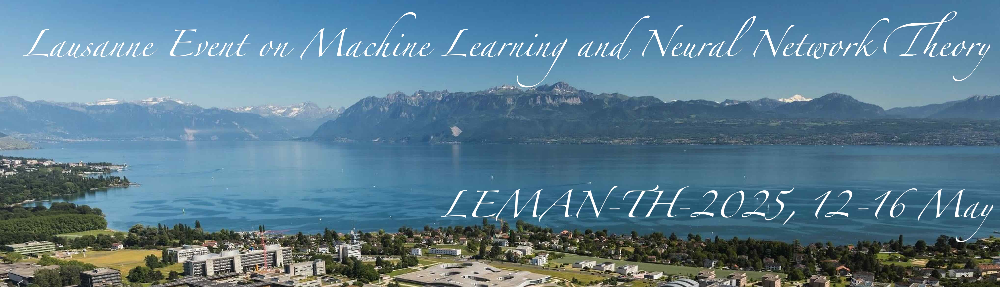

The past decade brought a revolution to machine learning: algorithms are now able to deal with tasks and amounts of data that seemed to be science fiction only a decade ago. The program will concentrate on theoretical aspect of machine learning and neural network, and their deep link with high-dimensional statistics, statistical physics and computer science. It will highlight discussions at the intersection of probablity theory, statistical physics, optimization and theoretical computer science.

__Organisers:__ Florent Krzakala (EPFL, IdePhics Lab.), and Bruno Loureiro (DI-ENS & CNRS)

# Schedule

TBA

# Venue :

[Bernoullli Center](https://bernoulli.epfl.ch/), EPFL, Lausanne.

# Registration

TBA

# Invited speakers

TBA

=======

